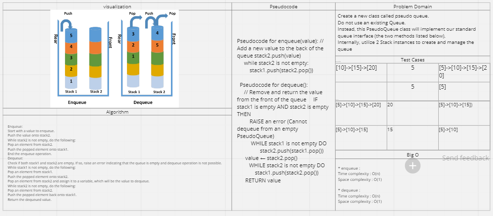

# stack-queue-pseudo

## Feature Tasks

Create a new class called pseudo queue.

Do not use an existing Queue.
Instead, this PseudoQueue class will implement our standard queue interface (the two methods listed below),
Internally, utilize 2 Stack instances to create and manage the queue

Methods:

enqueue
Arguments: value
Inserts a value into the PseudoQueue, using a first-in, first-out approach.

dequeue
Arguments: none
Extracts a value from the PseudoQueue, using a first-in, first-out approach.

## Whiteboard Process

## Stack Approach & Efficiency

* enqueue : 
Time complexity : O(n)
Space complexity : O(1)

* dequeue : 
Time complexity : O(n)
Space complexity : O(1)

