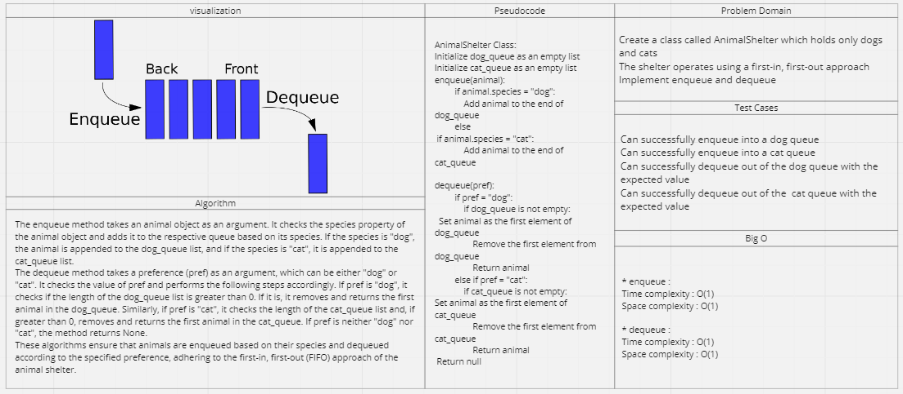

# Stack Queue Animal Shelter

## Feature Tasks

Create a class called AnimalShelter which holds only dogs and cats
The shelter operates using a first-in, first-out approach
Implement enqueue and dequeue

## Whiteboard Process

## Stack Approach & Efficiency

* enqueue : 
Time complexity : O(1)
Space complexity : O(1)

* dequeue : 
Time complexity : O(1)
Space complexity : O(1)

