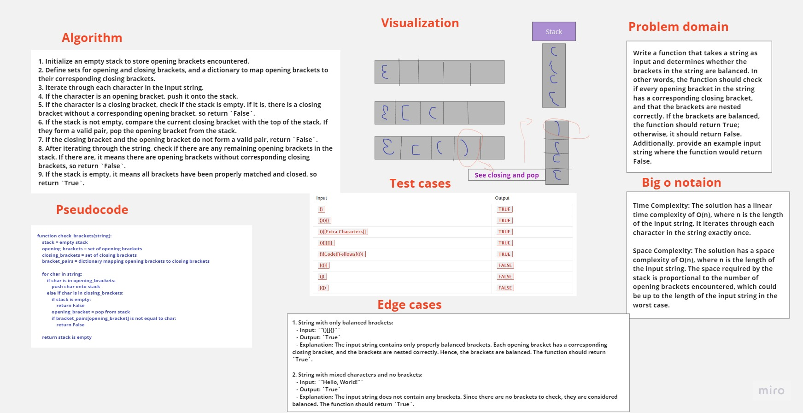

# stack queue brackets

## Feature Tasks

Write a function called validate brackets that take a string and return a boolean representing whether or not the brackets in the string are balanced

## Whiteboard Process

## Approach & Efficiency

Time complexity : O(n)
Space complexity : O(n)

