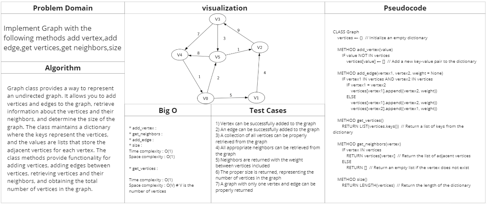

# Graph

## Feature Tasks

Implement Graph with the following methods:

* add_vertex
* get_neighbors
* add_edge
* get_vertices 
* size

## Whiteboard Process

## Approach & Efficiency

* add_vertex : 
* get_neighbors :
* add_edge : 
* size : 

Time complexity : O(1)
Space complexity : O(1)

* get_vertices : 

Time complexity : O(1)
Space complexity : O(V) # V is the number of vertices

## Solution

### [Link to code (Graph) ](./../graph/graph/graph.py)

### [Link to test code (Graph) ](./../graph/tests/test_graph.py)

### to run this code :
    python3 -m venv .venv
    source .venv/bin/activate
    pip install -r requirements.txt
    pytest

    //after finishing 
    deactivate