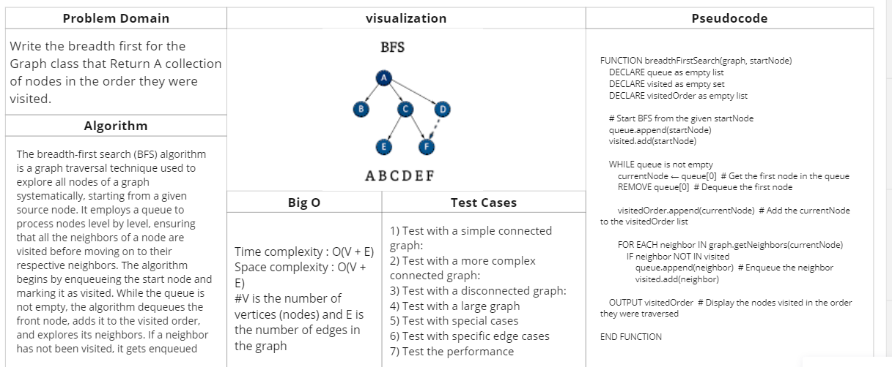

# graph breadth first

## Feature Tasks

Write the breadth first for the Graph class that Return A collection of nodes in the order they were visited.

## Whiteboard Process

## Approach & Efficiency

Time complexity : O(V + E)
Space complexity : O(V + E)

V is the number of vertices (nodes) and E is the number of edges in the graph

## Solution

### [Link to code (graph breadth first) ](./../graph/graph/graphbreadthfirst.py)

### [Link to test code (graph breadth first) ](./../graph/tests/test_graphbreadthfirst.py)

### to run this code :
    python3 -m venv .venv
    source .venv/bin/activate
    pip install -r requirements.txt
    pytest

    //after finishing 
    deactivate

