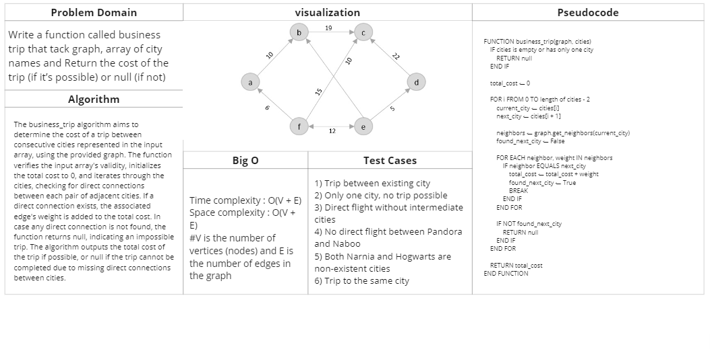

# graph business trip

## Feature Tasks

Write a function called business trip that tack graph, array of city names and Return the cost of the trip (if it’s possible) or null (if not)

## Whiteboard Process

## Approach & Efficiency

Time complexity : O(V + E)
Space complexity : O(V + E)

V is the number of vertices (nodes) and E is the number of edges in the graph

## Solution

### [Link to code (graph business trip) ](./../graph/graph/graphbusinesstrip.py)

### [Link to test code (graph business trip) ](./../graph/tests/test_graphbusinesstrip.py)

### to run this code :
    python3 -m venv .venv
    source .venv/bin/activate
    pip install -r requirements.txt
    pytest

    //after finishing 
    deactivate

