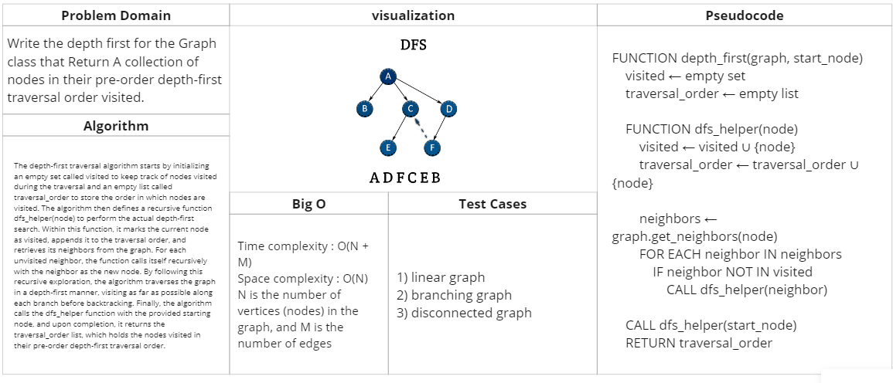

# graph depth first

## Feature Tasks

Write the depth first for the Graph class that Return A collection of nodes in their pre-order depth-first traversal order visited.

## Whiteboard Process

## Approach & Efficiency

Time complexity : O(N + M)
Space complexity : O(N)

N is the number of vertices (nodes) in the graph, and M is the number of edges

## Solution

### [Link to code (graph depth first) ](./../graph/graph/graphdepthfirst.py)

### [Link to test code (graph depth first) ](./../graph/tests/test_graphdepthfirst.py)

### to run this code :
    python3 -m venv .venv
    source .venv/bin/activate
    pip install -r requirements.txt
    pytest

    //after finishing 
    deactivate

