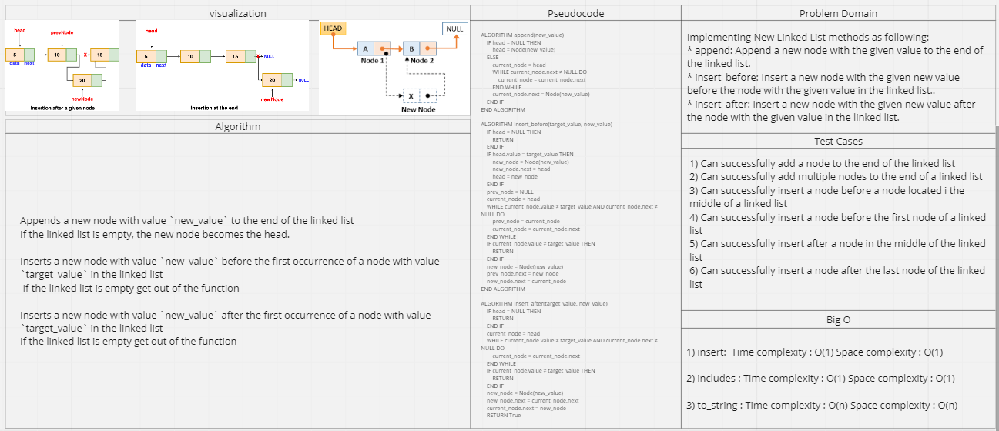

# Linked List

## Feature Tasks
Implementing New Linked List methods as following:

* append: Append a new node with the given value to the end of the linked list.
* insert_before: Insert a new node with the given new value before the node with the given value in the linked list..
* insert_after: Insert a new node with the given new value after the node with the given value in the linked list.

## Whiteboard Process

## Approach & Efficiency

* append : 
Time complexity : O(n)
Space complexity : O(1)

* insert_before : 
Time complexity : O(n)
Space complexity : O(1)

* insert_after : 
Time complexity : O(n)
Space complexity : O(1)

