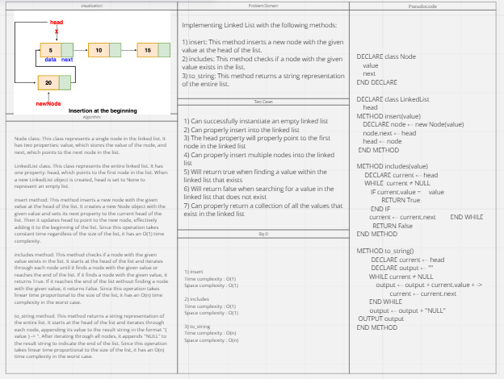

# Linked List

## Feature Tasks
Implementing Linked List with the following methods:

* insert: This method inserts a new node with the given value at the head of the list.
* includes: This method checks if a node with the given value exists in the list.
* to_string: This method returns a string representation of the entire list.

## Whiteboard Process

## Approach & Efficiency

* insert : 
Time complexity : O(1)
Space complexity : O(1)

* includes : 
Time complexity : O(1)
Space complexity : O(1)

* to_string : 
Time complexity : O(n)
Space complexity : O(n)

