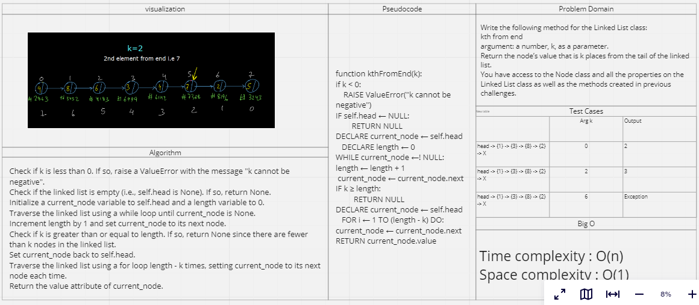

# Linked List

## Feature Tasks

Write the following method for the Linked List class:

kth from end
argument: a number, k, as a parameter.
Return the node’s value that is k places from the tail of the linked list.
You have access to the Node class and all the properties on the Linked List class as well as the methods created in previous challenges.

## Whiteboard Process

## Approach & Efficiency

Time complexity : O(n)
Space complexity : O(1)

## Solution

### [Link to code](./../linkedList/linkedList/linkedList.py)

### [Link to test code](./../linkedList/tests/extendLinkedList_test.py)

