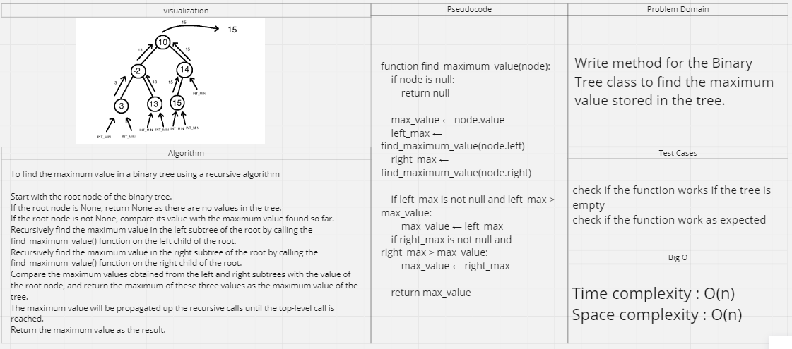

# Max Trees

## Feature Tasks

Write method for the Binary Tree class to
find the maximum value stored in the tree.

## Whiteboard Process

## Approach & Efficiency

Time complexity : O(n)
Space complexity : O(n)
