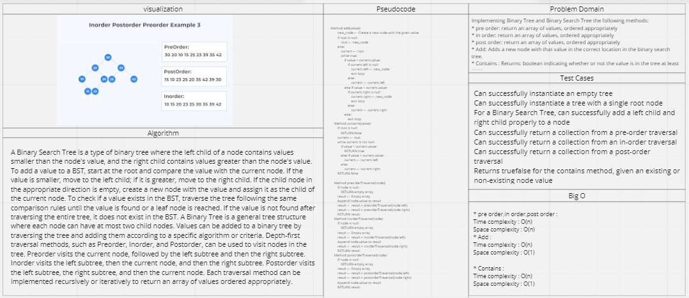

# Trees

## Feature Tasks
Implementing Binary Tree and Binary Search Tree the following methods:

* pre order: return an array of values, ordered appropriately
* in order: return an array of values, ordered appropriately
* post order: return an array of values, ordered appropriately
* Add: Adds a new node with that value in the correct location in the binary search tree.
* Contains : Returns: boolean indicating whether or not the value is in the tree at least once.

## Whiteboard Process

## Approach & Efficiency

* pre order,in order,post order : 
Time complexity : O(n)
Space complexity : O(n)

* Add : 
Time complexity : O(n)
Space complexity : O(1)

* Contains : 
Time complexity : O(n)
Space complexity : O(1)

