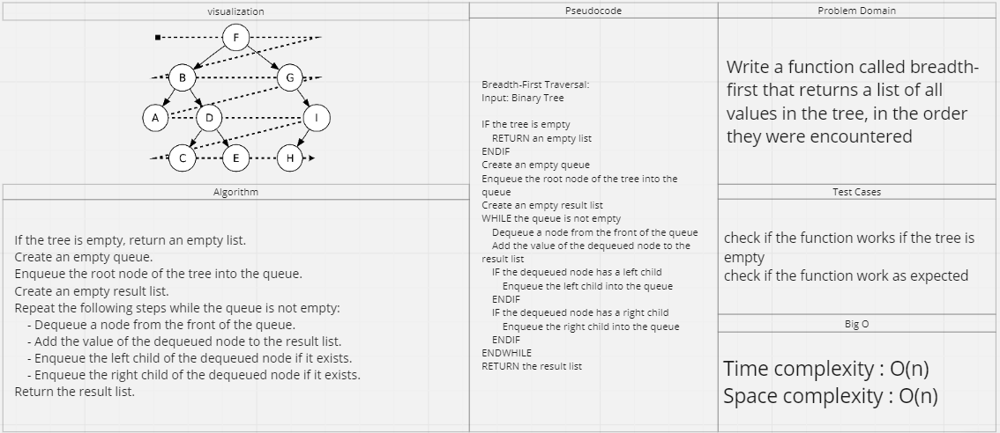

# tree breadth first

## Feature Tasks

Write a function called breadth-first that returns a list of all values in the tree, in the order they were encountered

## Whiteboard Process

## Approach & Efficiency

Time complexity : O(n)
Space complexity : O(n)

